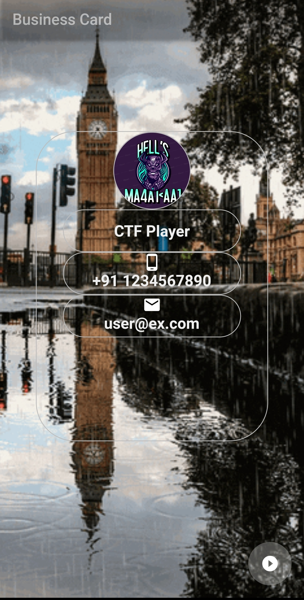

# Buissness_Card
<h4>
This is an Buisness_Card Type app by the use of flutter framework.... 
To setup this same App in your PC then ---</h4>
<pre>
  -->First Make the test app by the help of the Command;
       # flutter create your_app_name
  --> Then make some changes like replace from my file like:-
       1>. lib
       2>. assets
       3>. pubspec.yaml
       4>. Card_App.iml
  --> Now Debug In your Mobile or AVD ...
</pre>
<h4>Screenshot :- </h4>

